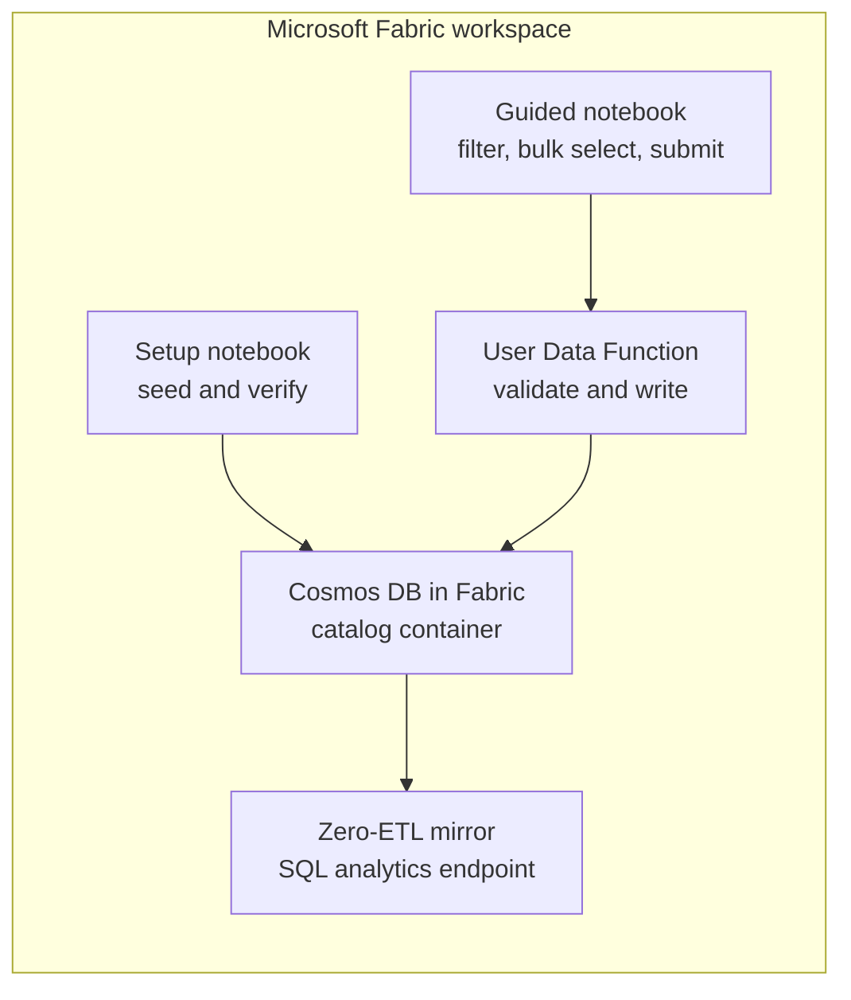

This demo builds a product-catalog write-back flow entirely in Microsoft Fabric. Cosmos DB in Fabric remains the operational source of truth, its zero-ETL mirror serves analytics through the generated SQL endpoint, and a Fabric User Data Function validates and applies single or bulk price changes.

<Callout>

This v1.1 candidate is **unlisted for tester validation**. It deploys the Cosmos DB database, setup notebook, guided write-back notebook, and price write-back User Data Function. Publishing the function remains a guided step. Power BI is intentionally deferred until the operational and mirrored-data contracts are final.

</Callout>

## Architecture

The setup notebook writes sample documents only to Cosmos DB. It does not create a Lakehouse copy or run a Data Factory ingestion pipeline.

## Product Model

The `SampleData` container uses `/categoryName` as its partition key and stores two document types:

| Document | Purpose | Important fields |
|---|---|---|
| `product` | Current sellable catalog state | `id`, `categoryName`, `sku`, `currentPrice`, `currency`, `inventory`, `version`, `attributes[]` |
| `priceChange` | Immutable write-back audit | `productId`, `categoryName`, `oldPrice`, `newPrice`, `reason`, `requestedBy`, `productVersion` |

The typed `attributes[]` array lets each category carry different properties without widening the core product schema. Stable fields remain first-class properties for predictable SQL queries.

Keeping a product and its audit records in the same category partition allows the User Data Function to patch the product and append the audit document in one Cosmos DB transactional batch. Bulk requests are atomic per product, not across categories, and return a result for every selected row.

## Current Deployment Slice

| Item | Type | Role |
|---|---|---|
| `00_CosmosCatalogSetup` | Notebook | Connects with the current Fabric identity, non-destructively seeds 120 deterministic products across six categories plus historical audit records, and verifies the catalog. |
| `01_CosmosCatalogWriteback` | Notebook | Filters the live catalog, selects up to 25 products, previews a bounded percentage adjustment, submits through the published User Data Function, and displays recent audit history. |
| `PriceWriteback` | User Data Function | Applies bounded price updates with optimistic concurrency and creates an immutable audit document in the same transactional batch. |

## Price Update Contract

Each selected product becomes a request containing `productId`, `categoryName`, `newPrice`, `reason`, and `expectedVersion`. The function rejects malformed prices, empty reasons, inactive products, stale versions, duplicate bulk rows, changes greater than 30%, and requests containing more than 25 products.

Successful requests increment the product version and append an immutable `priceChange` audit document. The function returns immediate `applied`, `rejected`, `conflict`, or `failed` status. The generated SQL analytics endpoint reflects the change after mirroring catches up.

## Try the Setup

1. Install the Jumpstart with `jumpstart.install("cosmos-catalog-translytical")`.
2. Open `00_CosmosCatalogSetup` and run all cells.
3. Verify the `SampleData` container contains 120 products across Bikes, Accessories, Camping, Clothing, Components, and Nutrition, plus seeded `priceChange` records.
4. Open `PriceWriteback` and publish it.
5. Open `01_CosmosCatalogWriteback` and run all cells.
6. Filter by category, select one or more products, enter a percentage adjustment and business reason, and submit the changes.
7. Review the immediate `applied`, `rejected`, `conflict`, or `failed` result.
8. Refresh the in-notebook audit history, then confirm the SQL analytics endpoint exposes the updated products and their `priceChange` audit documents after mirroring catches up.

The setup is deterministic and non-destructive. Rerunning it creates missing seed documents but preserves products that have already been updated through the function.

## Version History

- **v1.1:** deterministic 120-product catalog, six categories, historical audits, category filtering, bulk percentage updates, and recent audit history.
- **v1.0:** stable single-product workflow and reusable bulk-capable UDF, pinned at commit `1a496312061d7c7f790e5f88c463163c46a08111`.

Power BI remains deferred to the final increment so its model is built against the stable mirrored schema and audit workflow.

## Security

- Authentication uses Microsoft Entra ID and the current Fabric identity.
- No account keys, passwords, or connection strings belong in notebook, UDF, model, or report source.
- The published UDF connection should receive only the Cosmos data-plane permissions needed for catalog reads, item patches, and audit creates.
- Function callers cannot choose arbitrary endpoints, databases, containers, or patch paths.

## Requirements

- A Fabric workspace with capacity that supports Cosmos DB in Fabric and User Data Functions.
- Permission to create Fabric items and a Cosmos DB container.
- Fabric Runtime 2.0 or later for the setup and guided write-back notebooks.
- The `azure-cosmos` package available to both notebooks and the User Data Function.

## Resources

- [Fabric User Data Functions](https://learn.microsoft.com/fabric/data-engineering/user-data-functions/user-data-functions-overview)
- [Cosmos DB in Microsoft Fabric](https://learn.microsoft.com/fabric/database/cosmos-db/overview)